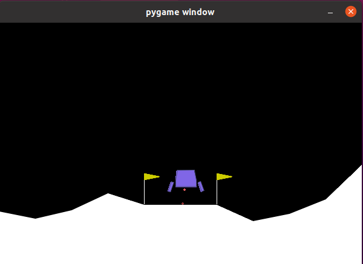
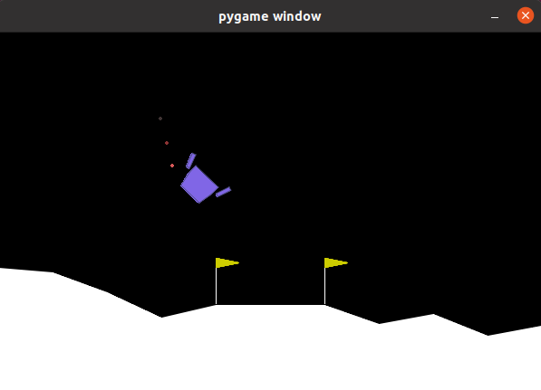

# 🚀 DQN Lunar Lander - Explorando o Espaço com Inteligência Artificial! 🌕

Bem-vindo ao **DQN Lunar Lander**, um experimento onde ensinamos um agente a pousar suavemente em um planeta alienígena! 🌌🛸

---

## 🤖 Sobre o Projeto

Neste projeto, utilizamos **Deep Q-Networks (DQN)** para treinar um agente no ambiente *LunarLander-v3*, fornecido pelo Gymnasium. O objetivo? Fazer com que nossa nave pouse de forma segura sem explodir! 💥🔥

---

## 📦 Explicando o Script Linha por Linha

### 1️⃣ Importação das Bibliotecas
```python
import gymnasium as gym
import numpy as np
from stable_baselines3 import DQN
from stable_baselines3.common.evaluation import evaluate_policy
```
O **Gymnasium** fornece o ambiente de simulação, enquanto o **NumPy** é utilizado para operações matemáticas e manipulação de arrays. O algoritmo **DQN** aplica aprendizado por reforço baseado em Q-Learning profundo. Por fim, a função **evaluate_policy** avalia o desempenho do agente após o treinamento.

### 2️⃣ Criando o Ambiente
```python
env = gym.make("LunarLander-v3", render_mode="rgb_array")
```
O **gym.make()** cria um ambiente de simulação baseado no jogo **Lunar Lander**, permitindo a interação com o ambiente. A opção **render_mode="rgb_array"** configura a renderização para capturar imagens do jogo em formato de array RGB, possibilitando o processamento visual se necessário.

### 3️⃣ Definição do Modelo DQN
```python
model = DQN(
    policy="MlpPolicy",
    env=env,
    verbose=1,
    learning_rate=1e-3,
    buffer_size=100_000,
    learning_starts=10_000,
    batch_size=64,
    gamma=0.99,
    exploration_fraction=0.1,
    exploration_final_eps=0.05,
    train_freq=4,
    target_update_interval=1000,
)
```
A **policy="MlpPolicy"** define uma política de aprendizado baseada em redes neurais MLP (Multilayer Perceptron). O parâmetro **env=env** associa o modelo ao ambiente de simulação. Com **verbose=1**, são fornecidas informações sobre o treinamento. A **learning_rate=1e-3** define a taxa de aprendizado, enquanto **buffer_size=100_000** especifica o tamanho do buffer de replay. O aprendizado começa após **learning_starts=10_000** interações, com **batch_size=64** para o tamanho do lote. O **gamma=0.99** é o fator de desconto para aprendizado futuro, e **exploration_fraction=0.1** regula a exploração. O limite inferior da exploração é dado por **exploration_final_eps=0.05**. A **train_freq=4** indica a frequência de treinamento, e **target_update_interval=1000** define o intervalo para atualizar a rede-alvo.

### 4️⃣ Treinamento do Modelo
```python
print("Iniciando treinamento...")
model.learn(total_timesteps=int(200_000), progress_bar=True)
```
**model.learn()**: Treina o agente por 200.000 timesteps.
**progress_bar=True**: Exibe o progresso do treinamento.

### 5️⃣ Salvando o Modelo Treinado
```python
model.save("dqn_lunar")
print("Modelo salvo como dqn_lunar.zip")
```
**model.save("dqn_lunar")**: Salva o modelo treinado em um arquivo ZIP.

### 6️⃣ Recarregando o Modelo
```python
del model
model = DQN.load("dqn_lunar", env=env)
print("Modelo carregado!")
```
**del model**: Remove o modelo da memória.
**DQN.load("dqn_lunar", env=env)**: Carrega o modelo salvo e associa ao ambiente.

### 7️⃣ Avaliação do Agente
```python
mean_reward, std_reward = evaluate_policy(model, env, n_eval_episodes=10)
print(f"Recompensa média: {mean_reward:.2f} ± {std_reward:.2f}")
```
**evaluate_policy()**: Mede o desempenho do agente com 10 episódios de teste.
 **mean_reward**: Média das recompensas obtidas.
**std_reward**: Desvio padrão das recompensas.

### 8️⃣ Executando o Agente Treinado
```python
obs, _ = env.reset()
rewards = []

for i in range(1000):
    action, _ = model.predict(obs, deterministic=True)
    obs, reward, done, _, _ = env.step(action)
    rewards.append(reward)
    env.render()
    
    if done:
        obs, _ = env.reset()
```
**env.reset()**: Reinicia o ambiente.
**model.predict(obs, deterministic=True)**: Escolhe a melhor ação baseada na política treinada.
**env.step(action)**: Aplica a ação ao ambiente.
**env.render()**: Renderiza a simulação.
**if done:** Reinicia o ambiente ao final do episódio.

### 9️⃣ Fechando o Ambiente
```python
env.close()
```
- **env.close()**: Fecha a simulação e libera os recursos.

---

## 🚀 Como Rodar o Projeto?

### 1️⃣ Instale as dependências
```bash
pip install gymnasium numpy stable-baselines3
```

### 2️⃣ Execute o script
```bash
python3 aprendizado.py
```

### 3️⃣ Assista ao pouso (ou explosão)!
Se tudo der certo, seu agente pousará suavemente. Se não... bem, foguetes são difíceis de pilotar! 😆

```bash
python3 visualização.py
```

---
                                      


-

-

-
