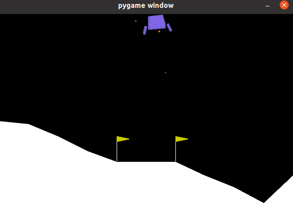

# 🚀 DQN Lunar Lander - Exploring Space with Artificial Intelligence! 🌕

Welcome to **DQN Lunar Lander**, an experiment where we teach an agent to land softly on an alien planet! 🌌🛸

---

## 🤖 About the Project

In this project, we use **Deep Q-Networks (DQN)** to train an agent in the *LunarLander-v3* environment, provided by Gymnasium. The goal? To make our ship land safely without exploding! 💥🔥

---

## 📦 Explaining the Script Line by Line

### 1️⃣ Importing Libraries
```python
import gymnasium as gym
import numpy as np
from stable_baselines3 import DQN
from stable_baselines3.common.evaluation import evaluate_policy
```
**Gymnasium** provides the simulation environment, while **NumPy** is used for mathematical operations and array manipulation. The **DQN** algorithm applies reinforcement learning based on deep Q-Learning. Finally, the **evaluate_policy** function evaluates the agent's performance after training.

### 2️⃣ Creating the Environment
```python
env = gym.make("LunarLander-v3", render_mode="rgb_array")
```
The **gym.make()** creates a simulation environment based on the **Lunar Lander** game, allowing interaction with the environment. The **render_mode="rgb_array"** option configures the rendering to capture images from the game in RGB array format, allowing visual processing if necessary.

### 3️⃣ DQN Model Definition
```python
model = DQN(
policy="MlpPolicy",
env=env,
verbose=1,
learning_rate=1e-3,
buffer_size=100_000,
learning_starts=10_000,
batch_size=64,
gamma=0.99,
exploration_fraction=0.1,
exploration_final_eps=0.05,
train_freq=4,
target_update_interval=1000,
)
```
The **policy="MlpPolicy"** defines a learning policy based on MLP (Multilayer Perceptron) neural networks. The **env=env** parameter associates the model with the simulation environment. With **verbose=1**, information about the training is provided. The **learning_rate=1e-3** sets the learning rate, while **buffer_size=100_000** specifies the size of the replay buffer. Learning starts after **learning_starts=10_000** iterations, with **batch_size=64** for the batch size. The **gamma=0.99** is the discount factor for future learning, and **exploration_fraction=0.1** regulates the exploration. The lower bound of exploration is given by **exploration_final_eps=0.05**. The **train_freq=4** indicates the training frequency, and **target_update_interval=1000** sets the interval to update the target network.

### 4️⃣ Model Training
```python
print("Starting training...")
model.learn(total_timesteps=int(200_000), progress_bar=True)
```
**model.learn()**: Trains the agent for 200,000 timesteps.
**progress_bar=True**: Displays the training progress.

### 5️⃣ Saving the Trained Model
```python
model.save("dqn_lunar")
print("Model saved as dqn_lunar.zip")
```
**model.save("dqn_lunar")**: Saves the trained model to a ZIP file.

### 6️⃣ Reloading the Model
```python
del model
model = DQN.load("dqn_lunar", env=env)
print("Model loaded!")
```
**del model**: Removes the model from memory.
**DQN.load("dqn_lunar", env=env)**: Loads the saved model and associates it with the environment.

### 7️⃣ Agent Evaluation
```python
mean_reward, std_reward = evaluate_policy(model, env, n_eval_episodes=10)
print(f"Average reward: {mean_reward:.2f} ± {std_reward:.2f}")
```
**evaluate_policy()**: Measures the agent's performance with 10 test episodes. **mean_reward**: Average of the rewards obtained.
**std_reward**: Standard deviation of the rewards.

### 8️⃣ Running the Trained Agent
```python
obs, _ = env.reset()
rewards = []

for i in range(1000):
action, _ = model.predict(obs, deterministic=True)
obs, reward, done, _, _ = env.step(action)
rewards.append(reward)
env.render()

if done:
obs, _ = env.reset()
```
**env.reset()**: Resets the environment.
**model.predict(obs, deterministic=True)**: Chooses the best action based on the trained policy.
**env.step(action)**: Applies the action to the environment. **env.render()**: Renders the simulation.
**if done:** Restarts the environment at the end of the episode.

### 9️⃣ Closing the Environment
```python
env.close()
```
- **env.close()**: Closes the simulation and releases the resources.

---
## 🚀 How to Run the Project?

### 1️⃣ Install the dependencies
```bash
pip install gymnasium numpy stable-baselines3
```

### 2️⃣ Run the script
```bash
python3 learning.py
```

### 3️⃣ Watch the landing (or explosion)!
If everything goes well, your agent will land smoothly. If not... well, rockets are hard to fly! 😆

```bash
python3 preview.py
```

---


-

-

